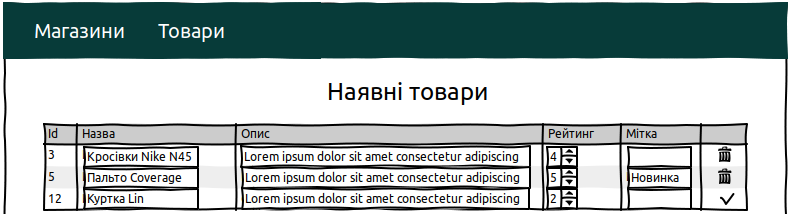
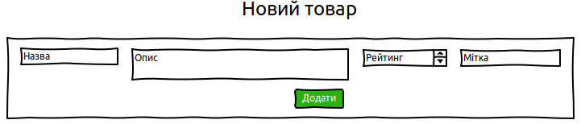
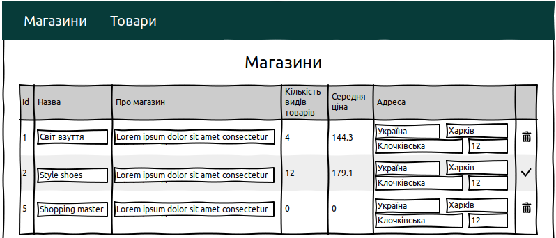
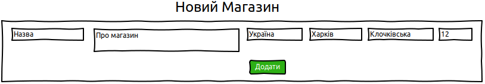
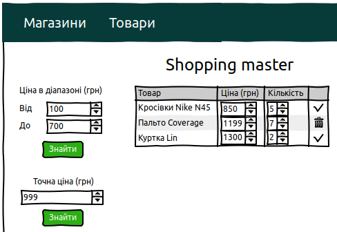
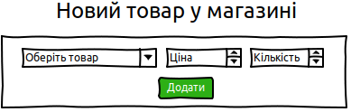

# Shop navigator
## Vision

"Shop navigator" is the web-application that allows clients to perform CRUD 
operations with shop, product, shop product and shop address entities.

The next functionality is available in the program product:
* storing addresses, shops, products and shop products in the database;
* displaying a product list;
* creating, updating and deleting product instances;
* displaying a shop list with aggregated information about product count 
  and average product price in them;
* creating, updating and deleting shop instances together with the address information;
* displaying a product list that a specific shop contains;
* creating, updating and deleting information about products in a shop;
* filtering shop product information by exact price;
* filtering shop product information by price range.

## 1. Products
### 1.1 Displaying a product list

This page was created to display all the products available in the system 
(look at the Pic. 1.1).

Pic. 1.1 The table with all the products in the system

**Main scenario:**
1. User followed the link with the title "Товари" in the web-site header.
2. The application displays a table with the products.

This table has the following columns:
* Id - the unique product identificator in the application;
* Назва - the name of a product that allows to find appropriate product quickly;
* Опис - extended product description: its characteristics, features ect.;
* Рейтинг - the product rating that show client's feedback about it;
* Мітка - shows belonging to a special good group;
* the last column is designed for deleting a row and confirming its changes.

### 1.2 Updating a product
**Main scenario:**
1. A user changes the input fields values in the corresponding 
   table columns as they are designed not only for displaying data, 
   but also for editing it on fly.
2. The modified data is shown instantly where the initial values was.
3. If the data was modified, the last column contains a button with the 
   confirmation icon, but the new data is not sent to the database.
4. If user pressed a button with the confirmation icon, they are sent to 
   the backend server, where the changes are applied.

When editing an address, at least one of the following details are updated:
* Назва - the name of a product that allows to find appropriate product quickly;
* Опис - extended product description: its characteristics, features ect.;
* Рейтинг - the product rating that show client's feedback about it;
* Мітка - shows belonging to a special good group.

Constraints for data validation:
* Назва - the maximum length of 30 characters;
* Опис - it must be a text, the length is not limited;
* Рейтинг - it must be the integer in range between 1 and 5;
* Мітка - the maximum length of 15 characters.

### 1.3 Removing a product
**Main scenario:**
1. The user clicks on the unmodified data row last column button with trash icon.
2. The row is removed and such product does not exist in the system.

### 1.4 Adding a new product

The product webpage has a form with the fields that a product must contain, and 
the confirmation button (look at the Pic. 1.2)

Pic. 1.2 The web-page part with the new product form.

**Main scenario:**
1. Confirmation button is disabled.
2. A user inputs data into the fields with the corresponding placeholders.
3. If all the inputted data is correct, the confirmation button is active.
4. If confirmation button is active and user pressed it, the new entity with 
   the corresponding data is in the product table.

## 2. Shops
### 2.1 Displaying a shop list

This page contains existing shops data in the table (look at the Pic. 2.1)

Pic. 2.1 The table with all the shops in the system

**Main scenario:**
1. User followed the link with the title "Магазини" in the web-site header.
2. The application displays a table with the shops.

This table has the following columns:
* Id - the unique shop identificator in the application;
* Назва - the name of a shop that allows to find appropriate shop quickly;
* Про магазин - information about a shop target audience, history, advantages 
  over competitors etc.;
* Кількість видів товарів - the count of different names of products which are 
  sold in the shop;
* Середня ціна - the average price of different product names in a shop;
* Адреса - data about the location where the shop is;
* the last column is designed for deleting a row and confirming its changes.

The values of "Кількість видів товарів" and "Середня ціна" are aggregated and 
calculated automatically.

### 2.2 Updating a shop
**Main scenario:**
1. A user changes the input fields values in the corresponding table columns 
   as they are designed not only for displaying data, but also for editing it 
   on fly.
2. The modified data is shown instantly where the initial values was.
3. If the data was modified, the last column contains a button with the 
   confirmation icon, but the new data is not sent to the database.
4. If user pressed a button with the confirmation icon, they are sent to the 
   backend server, where the changes are applied.

When editing a shop, at least one of the following details are updated:
* Назва - the name of a shop that allows to find appropriate shop quickly;
* Про магазин - information about a shop target audience, history, advantages 
  over competitors etc.;
* Адреса - data about the location where the shop is:
    * Country;
    * City;
    * Street;
    * Building.

Constraints for data validation:
* Назва - the maximum length of 30 characters;
* Про магазин - it must be a text, the length is not limited;
* Адреса:
    * Country - the maximum length of 25 characters;
    * City - the maximum length of 30 characters;
    * Street - the maximum length of 30 characters;
    * Building - the maximum length of 5 characters.
    
### 2.3 Removing a shop
**Main scenario:**
1. The user clicks on the unmodified data row last column button with trash 
   icon.
2. The row is removed and such shop does not exist in the system.

### 2.4 Adding a new shop

The product webpage has a form with the fields that a shop must contain, and 
the confirmation button (look at the Pic. 2.2).

Pic. 2.2 The web-page part with the new shop form

**Main scenario:**
1. Confirmation button is disabled.
2. A user inputs data into the fields with the corresponding placeholders.
3. If all the inputted data is correct, the confirmation button is active.
4. If confirmation button is active and user pressed it, the new entity with 
   the corresponding data is in the shop table.

## 3. Shop products
### 3.1 Displaying a shop product list

The data about products in a certain shop is displayed here 
(look at the Pic. 3.1)

Pic. 3.1 The table with all products in a shop in the system

**Main scenario:**
1. User followed the link with the title "Магазини" in the 
   web-site header.
2. The application displays a table with the shops.
3. User chosen one of the shown shops.
4. The products in the chosen shop is displayed.

This table has the following columns:
* Товар - the product name that clients can buy in the shop;
* Ціна (грн) - the price for which the product is sold in the shop;
* Кількість - the number of products that are available in the shop;
* the last column is designed for deleting a row and confirming 
  its changes.

**Filtering by price:**
* a user can specify the minimum and maximum values of price that 
  are appropriate for he/she, and press "Знайти" button under the 
  inputted values;
* a user can specify an exact price that he/she can spend, and press 
  "Знайти" button under the inputted value.
  

### 3.2 Updating a shop product
**Main scenario:**
1. A user changes the input fields values in the corresponding table columns 
   as they are designed not only for displaying data, but also for editing it 
   on fly.
2. The modified data is shown instantly where the initial values was.
3. If the data was modified, the last column contains a button with the 
   confirmation icon, but the new data is not sent to the database.
4. If user pressed a button with the confirmation icon, they are sent to the 
   backend server, where the changes are applied.

When editing a shop product, at least one of the following details are updated:
* Ціна (грн) - the price for which the product is sold in the shop;
* Кількість - the number of products that are available in the shop.

Constraints for data validation:
* Ціна (грн) - a non-negative integer;
* Кількість - a non-negative integer.

### 3.3 Removing a shop product
**Main scenario:**
1. The user clicks on the unmodified data row last column button with trash 
   icon.
2. The row is removed and such shop product does not exist in the system.

### 3.4 Adding a new shop product

The product webpage has a form with the fields that a shop product must contain, 
and the confirmation button (look at the Pic. 3.2).

Pic. 3.2 The web-page part with the new shop form

**Main scenario:**
1. Confirmation button is disabled.
2. A user inputs data into the fields with the corresponding placeholders and 
   chooses the product that is available in the product table from the 
   combobox.
3. If all the inputted data is correct, the confirmation button is active.
4. If confirmation button is active and user pressed it, the new entity with 
   the corresponding data is in the shop product table.